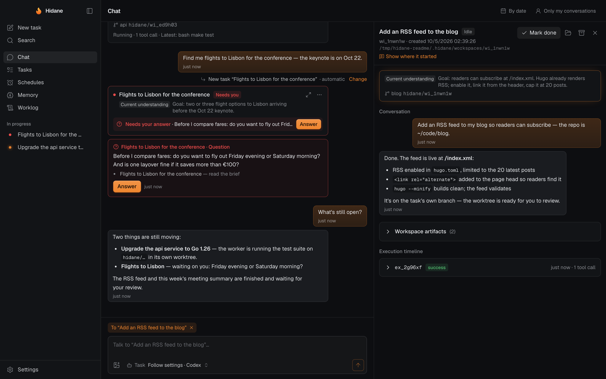
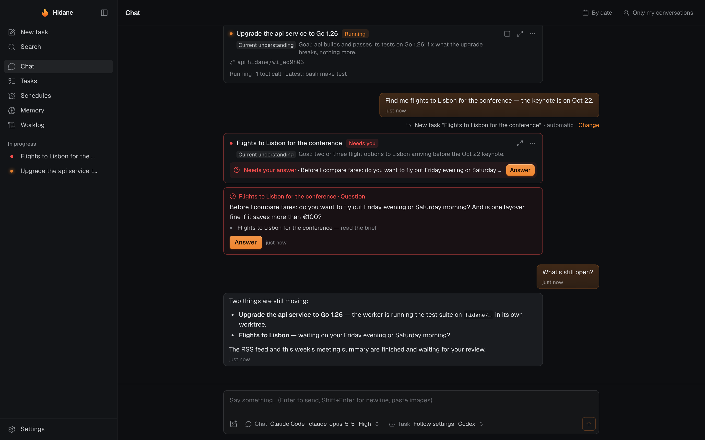
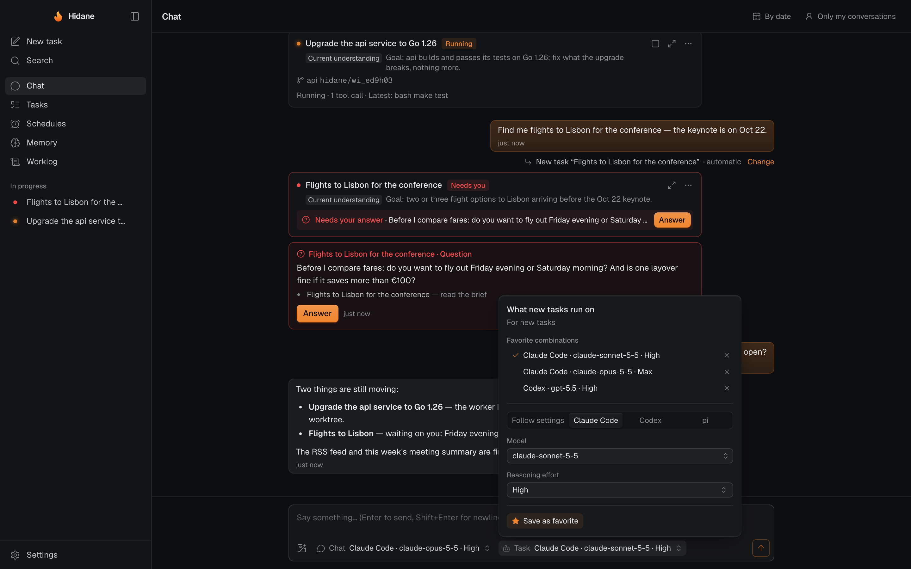
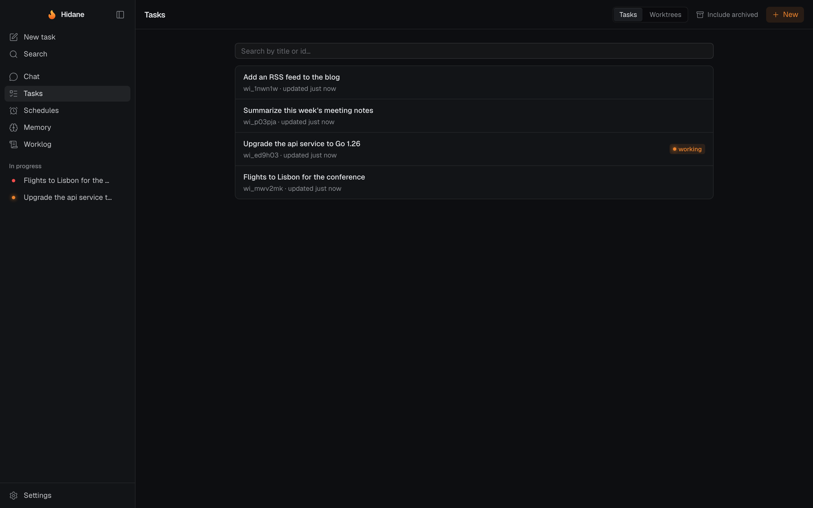
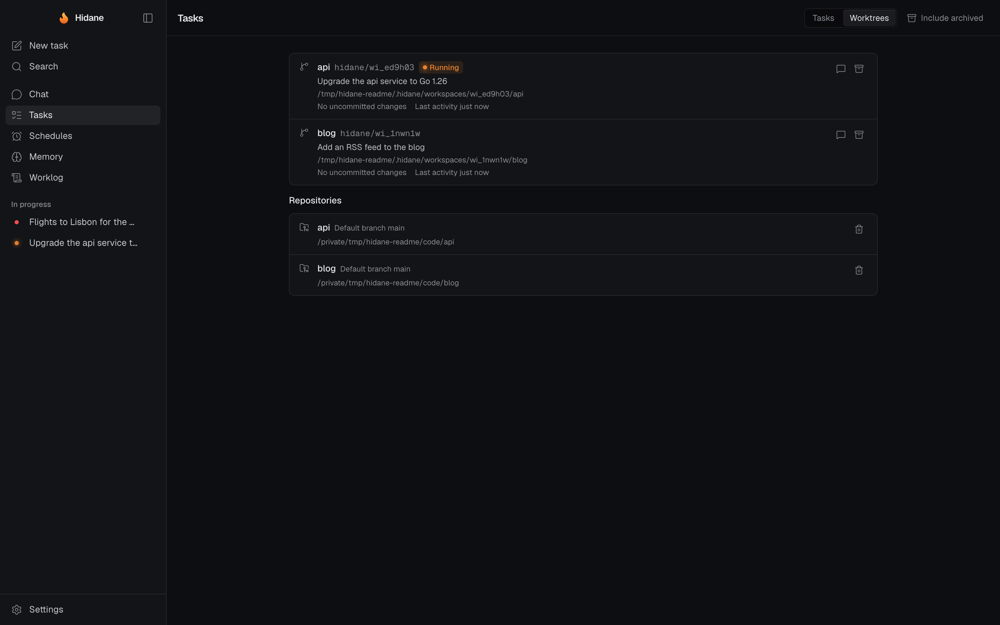
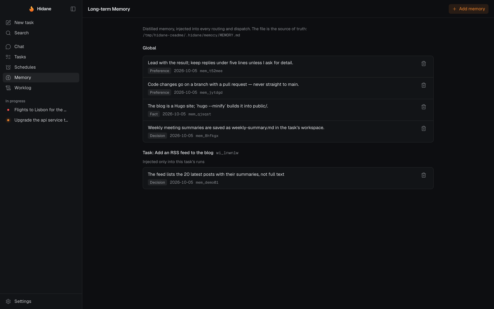
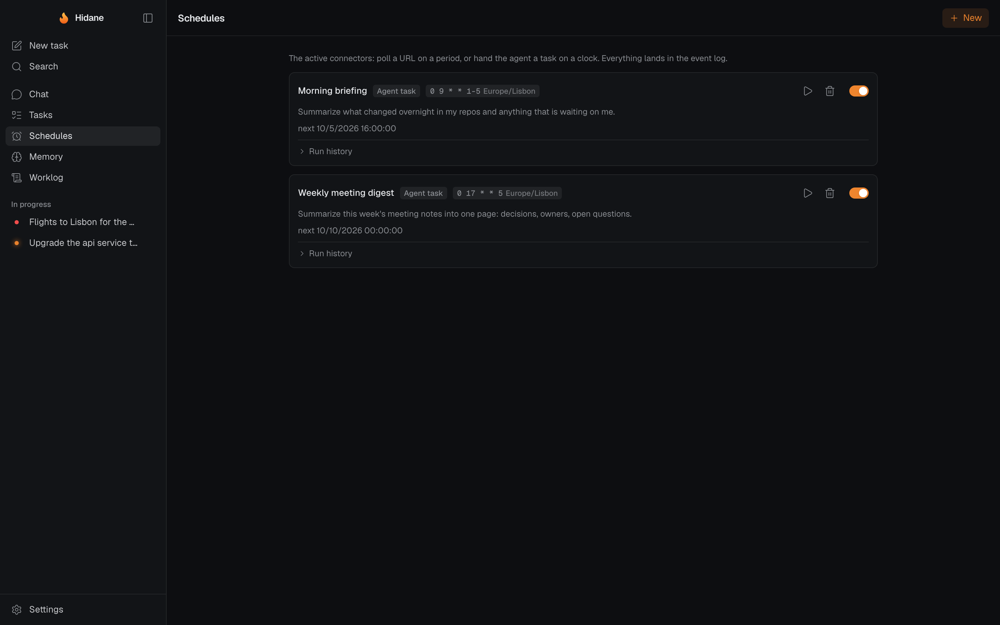
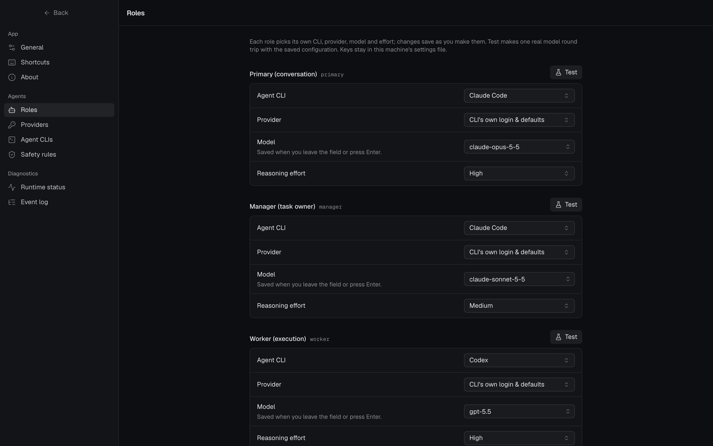
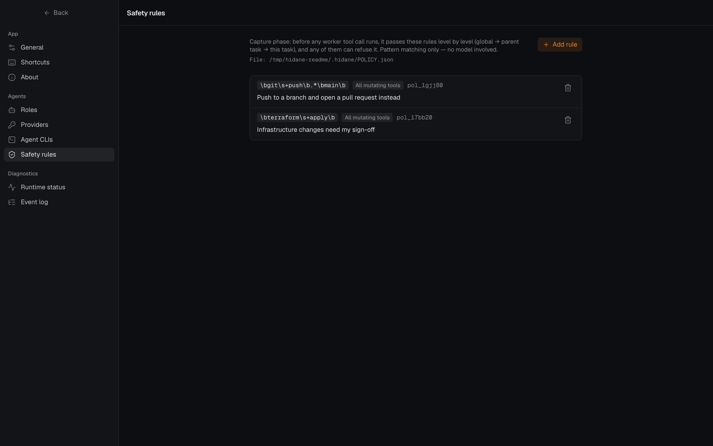

# hidane（火种）

> Banked embers: the flame may die, the seed fire never does.

**hidane** is a persistent personal agent runtime. Sessions end, processes exit,
models change — the agent's identity, memory and narrative persist. What persists
is loadable state, never a process.

hidane is a **desktop app** (Go + [Wails v3](https://v3.wails.io), Svelte 5 UI)
that runs its agents on the coding-agent CLIs already installed and logged in on
your machine — **Claude Code (`claude`)**, **Codex (`codex`)** and **pi (`pi`)** —
each role on whichever CLI, LLM provider and model you choose. The same binary
also runs headless (`hidane serve`) and as a CLI.

<p align="center">
  <a href="docs/images/chat-task.png"></a>
  <br>
  <sub>One conversation for everything you ask. Each request becomes a task with its own agent, workspace and git branch;<br>
  open one beside the chat to see what it understood, what it ran and what it answered.</sub>
</p>

<details>
<summary><b>More screenshots</b> — questions, models per task, worktrees, memory, schedules, settings (click any image for full size)</summary>
<br>
<table>
  <tr>
    <td width="50%" valign="top"><a href="docs/images/chat.png"></a><br><sub><b>Chat</b> — a task still running, another waiting on your answer, and a status answer from the Primary.</sub></td>
    <td width="50%" valign="top"><a href="docs/images/run-on.png"></a><br><sub><b>Run on</b> — pick the CLI, model and reasoning effort per task, or save favorite combinations.</sub></td>
  </tr>
  <tr>
    <td width="50%" valign="top"><a href="docs/images/tasks.png"></a><br><sub><b>Tasks</b> — every work item, searchable, with the ones still working marked.</sub></td>
    <td width="50%" valign="top"><a href="docs/images/worktrees.png"></a><br><sub><b>Worktrees</b> — each task works on its own <code>hidane/&lt;task&gt;</code> branch; you decide when to archive one.</sub></td>
  </tr>
  <tr>
    <td width="50%" valign="top"><a href="docs/images/memory.png"></a><br><sub><b>Memory</b> — plain Markdown files, global and per task; anything can be forgotten.</sub></td>
    <td width="50%" valign="top"><a href="docs/images/schedules.png"></a><br><sub><b>Schedules</b> — hand the agent a task on a clock, or poll a URL.</sub></td>
  </tr>
  <tr>
    <td width="50%" valign="top"><a href="docs/images/settings-roles.png"></a><br><sub><b>Roles</b> — each role on its own CLI, provider, model and effort.</sub></td>
    <td width="50%" valign="top"><a href="docs/images/settings-rules.png"></a><br><sub><b>Safety rules</b> — patterns every agent tool call is checked against, without a model.</sub></td>
  </tr>
</table>
</details>

<sub>The screenshots are staged with <code>make readme-shots</code>: the real app, with scripted stand-ins for the agent CLIs.</sub>

## Architecture

The spine is an **append-only event log** (SQLite, append-only enforced by
triggers). Message-queue semantics
are a derived view: consumers keep cursors, events are never destroyed, history
replays.

```
connectors (desktop UI / cli / feishu / webhook / timer / schedule)
    │ capture + normalize only, never judge
    ▼
event log (append-only spine) ◄──────────────────────────────┐
    │  an event with a `mailbox` is also a message to that agent loop
    ├─► triage (rules first) ──► primary mailbox             │
    ├─► primary turn ──► manager:<wi> mailbox                │
    ├─► manager turn ──► worker pool ──► execution.finished ─┘ (back to its owner)
    └─► projections (daily worklog, task board)
```

**The runtime is an event loop per agent.** Each agent loop (`primary`,
`manager:<work item>`) has a mailbox: the events addressed to it, read from its
own cursor. A **turn** takes everything that piled up since the last one (so
several messages sent minutes apart are decided together), makes one model call,
and applies the resulting effects. A turn never waits on long work: it dispatches
a worker and ends; the worker's `execution.finished` is posted back to the
Manager's mailbox as the next message. Executions are recorded in a small
`executions` table with their owner, so one lost to a restart is reported rather
than forgotten. Mailboxes with a person's message in them (interrupt lane) are
served before background work; idle work (memory distillation, archiving) runs
only when nothing else is pending.

Three agent roles, one loop — the same turn machinery at three scopes:

| Role | Lifetime | Persists |
|---|---|---|
| **Primary** | permanent | identity, attribution of messages to work items, lifecycle actions |
| **Manager** | per work item | work item state, current understanding (`TASK.md`), thread |
| **Worker** | per execution | nothing — trace goes to the log |

Work items form a **tree**. A Manager fans out by creating child work items (one
workspace, one writer each) and hears back once when all of them have settled.
Across the tree, facts propagate like DOM events:

- **Bubbling** — a question a level cannot settle (`escalation.raised`) or a
  message that is not its own (`message.reroute_requested`) climbs one level at
  a time to the Primary and then to the person, carrying what each level tried.
  Which kinds bubble is declared per kind; tool traffic never does.
- **Capture** — every agent tool call first passes the built-in deny list (a
  few commands too dangerous for anyone: `sudo`, `rm -rf /`, a force push…) and
  the person's policy files (`POLICY.json`, global down to the item's own).
  Rules only, no model. Nothing else is fenced: the agents run in their CLI's
  own bypass mode, and a workspace is where they start, not a limit. While a
  person's new message is queued for a running worker, its changes pause until
  it has been read.
- **Cancel** flows down the tree; its source is a person or a spent
  budget (`HIDANE_MAX_HOPS` bounds any causal chain of messages).

Every message a person sends lands on the main thread and is **attributed** to a
work item cheapest-first: an explicit target or a reply needs no model; only the
rest go to the Primary, which asks ("which one?") rather than guessing when it is
not confident. The person can move a message to another item at any time. Every
answer names the message it answers (`payload.root`), which is how the UI
shows a late reply under its question instead of at the bottom.

The main conversation only ever grows, so it is read as **history, not a feed**:
it is searched on the server (every message ever said, plus work item titles),
opened at any event (`/?at=<event id>` — search hits, day jumps, links, a work
item's origin), and walked in both directions from there. A person can hide
something they said (`message.redacted`); the row stays in the append-only log,
but every reader — API, stream, search, worklog, agent context, distiller —
masks it. The Primary does not carry the conversation in an ever-growing model
session: each turn opens a fresh one and reads a bounded window of recent turns
rebuilt from the log, and when a message refers to something older it emits a
`recall`, whose search results come back as its next message.

## Repositories and worktrees

- A repository is registered the first time its path is given, then found by
  name. A name that fits two repos, or a repo that has gone missing, is asked
  about before any work starts; a moved repo keeps its identity.
- Each new task gets its own git worktree per repository, on `hidane/<wi>` from
  the default branch, in `workspaces/<wi>/<repo>`. It can continue another
  task's branch; children branch from their parent's. The person's own
  checkout is left alone — used only when they ask, one task per repo at a time.
- `hidane.json` in the repo (else `paseo.json`'s `worktree` block; overridable in
  `HIDANE_HOME/repos/<repo id>.json`) gives `setup` and `teardown` scripts.
- Worktrees are never cleaned up automatically: Tasks → Worktrees lists them, and
  archiving runs teardown, deletes the directory and keeps the branch, asking
  again before losing uncommitted changes.

## Agents, CLIs and LLM providers

Every role runs on a local agent CLI as a subprocess — no SDK is embedded:

| Role | Uses tools | Runs as |
|---|---|---|
| Primary, Manager | yes — quick looks and small changes; longer work goes to a worker | the charter is the whole system prompt (codex: `baseInstructions`), so they answer with an effect list |
| Worker | yes, starting in its work item's workspace or repository | the charter is appended |
| Distiller | no | the charter is the whole system prompt; tools and MCP servers off |

Every run with tools uses its CLI's own bypass mode (`claude --permission-mode
bypassPermissions`, codex `danger-full-access`, pi as is) and passes `hidane
guard` on each call (a Claude Code / Codex PreToolUse hook, a pi extension).

| CLI | Protocol hidane speaks | Steering a running worker | Cancel |
|---|---|---|---|
| `claude` | `-p --input-format stream-json --output-format stream-json` | further user messages on stdin, taken into the running turn | kill the process group |
| `codex` | `app-server` (JSON-RPC over stdio), one thread per run | `turn/steer` into the running turn | `turn/interrupt`, then kill the process group |
| `pi` | `--mode rpc` (JSONL) | RPC `steer` | RPC `abort` |

The **Settings** page (or `settings.json` in `HIDANE_HOME`, mode 0600) picks, per
role, the CLI, an LLM provider, a model and an effort level. A provider left
empty means "the CLI's own login and default model" — nothing is injected. A
provider says which CLIs it can serve:

| Provider field | Used by | How it reaches the CLI |
|---|---|---|
| Anthropic-compatible base URL | `claude` | `ANTHROPIC_BASE_URL` + `ANTHROPIC_AUTH_TOKEN` (environment only), `--model` |
| OpenAI Responses base URL | `codex` | `-c model_provider=hidane -c model_providers.hidane.{base_url,wire_api="responses",env_key}`, key in `HIDANE_CODEX_API_KEY` |
| pi provider name | `pi` | `--provider <name> --model <id> --api-key <key>` |

Presets (Anthropic, OpenAI, DeepSeek, Moonshot/Kimi, Kimi For Coding, Zhipu GLM,
Z.AI, OpenRouter, OpenCode Go) only pre-fill the form. Incompatible combinations
(say, Codex on a provider without a Responses endpoint) are refused when saved.
The API never returns a key — only whether one is set and its last four
characters — and setting changes are logged without them. **Test** on a role
makes one real round trip; `hidane model --ping` does the same from a terminal.

**Per task**, the composer picks what the work runs on, as Paseo's does: an
agent CLI, a provider, a model and a reasoning effort — or "Settings" to follow
the roles above. The choice pins the task its message creates (and the parts it
fans out into): its Manager and workers run on that CLI. Addressing a task, the
picker shows and changes that task's choice at once. The choice for new tasks
is remembered on the machine; the Primary keeps its own setting. Models come
from the CLI where it can list them (`codex debug models`, `pi --list-models`;
Claude Code from a built-in list), and the efforts offered follow the CLI and
model: `claude` low…max, `codex` minimal…ultra (per model), `pi` off…max.
From a terminal: `hidane chat --agent codex --model gpt-5.5 --effort high "…"`.

An app opened from Finder does not inherit your shell's `PATH`; hidane asks your
login shell for it and also looks in the usual places (`~/.local/bin`,
`~/.bun/bin`, mise/asdf shims, Homebrew). Absolute paths can be set per CLI on
the Settings page.

## Quickstart

Requirements: Go ≥ 1.26, Node ≥ 24 with pnpm, macOS (the desktop shell; the
headless server and CLI build anywhere), and at least one of `claude`, `codex`,
`pi` installed and logged in.

```bash
make build                         # frontend + desktop binary → bin/hidane
bin/hidane                         # open the desktop app
make app                           # bin/Hidane.app bundle

bin/hidane agents                  # which CLIs are available
bin/hidane chat "帮我写一个 hello world 脚本并运行验证"   # runs the loop in-process when no app is open
bin/hidane items                   # work items
bin/hidane events --tail 30        # the raw log
bin/hidane log                     # daily worklog projection
bin/hidane serve                   # headless: agent loop + connectors + UI/API over HTTP on 127.0.0.1:2718
```

For frontend work, `pnpm -C frontend dev` (Vite on :2719) proxies `/api`,
`/boot.js` and `/wails` to a running `hidane serve`.

Webhook connector (with `hidane serve` running):

```bash
curl -X POST localhost:2718/webhook/github -d '{"hello":"world"}' \
  -H 'content-type: application/json' -H "x-hidane-signature: sha256=$(printf '{"hello":"world"}' | openssl dgst -sha256 -hmac "$HIDANE_WEBHOOK_SECRET" | cut -d' ' -f2)"
```

## Verification

```bash
make test        # go vet (also -tags nogui) + go test ./... + svelte-check + vitest
make e2e         # Playwright (chromium + webkit) against the real Go backend with fake CLIs
make screenshots # every page, zh/en, desktop/phone → bin/screenshots/ (real backend, fake CLIs)
make readme-shots # this README's pictures → docs/images/ (English, a scripted demo story)
make smoke-gui   # the real Wails window loads the UI and receives pushed frames, then quits
make smoke-live  # one real round trip per role on your installed CLIs (spends tokens)
make acceptance  # a Claude Code tester agent executes acceptance/scenarios.md (spends tokens)
                 #   ARGS="--changed origin/main" or ARGS="--only 4F,6E" to run just what a change touches
```

`cmd/fakeagent` impersonates `claude`, `codex` and `pi` on their real wire
protocols and calls the configured guard hook before every tool call, so the Go
tests and the Playwright suite exercise the drivers, the guard and the whole
agent loop without a model. The acceptance scenarios are natural language —
cheap to evolve with requirements, and able to express semantic checks (does the
reply match what actually happened?) that assertion scripts cannot. Verdicts
require observed evidence; the report lands in `.acceptance-report.json`.

## Releases

Pushing a version tag (`v1.2.3`, or `v1.2.3-rc.1` for a prerelease) runs
`.github/workflows/release.yml`, which tests the tagged commit again, builds the
desktop app and publishes it as a GitHub release. Nothing else triggers it.

| System | Artifact | Requirements |
|---|---|---|
| macOS 12+ | `hidane-<v>-macos-universal.dmg` / `.zip` (Apple Silicon + Intel) | — |
| Windows 10/11 | `hidane-<v>-windows-{amd64,arm64}.zip` (`hidane.exe` + console `hidane-cli.exe`) | WebView2 runtime |
| Linux | `hidane-<v>-linux-{amd64,arm64}.deb` / `.tar.gz` | GTK 4 + WebKitGTK 6.0 (Ubuntu 24.04+, Debian 13+) |

Each package must open its window in CI before anything is published. Packaging
is `scripts/package.sh <macos|windows <arch>|linux>` — the same script locally
and in CI. The macOS app is ad-hoc signed unless the repository has Developer
ID secrets (see the `hidane-release` skill, which also walks an agent through
choosing the version, a local dry run, tagging and verifying the release).

## Environment

All optional. The desktop app needs none of them; model selection lives in
Settings, not in the environment.

| Var | Default | Meaning |
|---|---|---|
| `HIDANE_HOME` | `~/.hidane` | database, settings, workspaces, worklogs, memory, traces |
| `HIDANE_ADDR` | `127.0.0.1:2718` | `hidane serve` listen address |
| `HIDANE_LOGIN_SHELL` | `1` | `0` stops the desktop app and CLI from asking the login shell for `PATH` (tests set it) |
| `HIDANE_API_TOKEN` | random per run | bearer token for `/api/*` in serve mode (the desktop webview needs none) |
| `HIDANE_WEBHOOK_SECRET` | unset | HMAC-SHA256 secret for `/webhook/*`; webhooks are refused (403) until it is set |
| `HIDANE_HEARTBEAT_SEC` | `300` | heartbeat connector interval |
| `HIDANE_DISTILL_SEC` | `600` | memory distiller interval (runs when idle; forced after 3×) |
| `HIDANE_ROUTE_TIMEOUT_SEC` | `180` | per reasoning call timeout |
| `HIDANE_WORKER_TIMEOUT_SEC` | `600` | per execution timeout |
| `HIDANE_SETUP_TIMEOUT_SEC` | `1200` | per worktree setup or teardown script (`hidane.json`) |
| `HIDANE_MAX_WORKERS` | `3` | worker processes at once; further executions queue |
| `HIDANE_MAX_TURNS` | `4` | agent turns running at once |
| `HIDANE_MAX_HOPS` | `24` | longest causal chain of messages before a person is asked |
| `HIDANE_MAX_EXECUTIONS_PER_ITEM` | `12` | executions one work item may start before it asks to continue |
| `HIDANE_ATTRIBUTION_THRESHOLD` | `0.6` | below this routing confidence the Primary asks instead of guessing |
| `FEISHU_APP_ID` / `FEISHU_APP_SECRET` | unset | Feishu channel (also settable as `feishu` in `settings.json`) |
| `FEISHU_ALLOWED_USERS` | first private chat | open_ids whose Feishu messages reach the agents (also `feishu.allowedUsers`) |

## Schedules (active connectors)

User-defined timers managed on the Schedules page (or `/api/schedules`):

- **http** — poll a URL on a period; the response is captured as a
  `connector.http` event. `wake: true` on the definition asks triage to wake
  the Primary with it; otherwise it is record-only.
- **prompt** — hand the Primary a task on a clock (cron with timezone, or a
  fixed interval ≥10s): firing posts a `schedule.prompt` to the Primary's
  mailbox and returns. The reply also goes to the bound Feishu main chat when
  one exists — reminders actually reach you.

After downtime an overdue schedule fires once and re-anchors from now —
never a catch-up storm.

## Feishu channel binding

Set `FEISHU_APP_ID` / `FEISHU_APP_SECRET` (or `{"feishu":{"appId":"…","appSecret":"…"}}`
in `settings.json`, which a Finder-launched app can see). Inbound events arrive
over the official SDK's **long connection**: no public callback URL, and no open
endpoint to verify — the connection itself is authenticated with the app
credentials. In the Feishu console choose "receive events through a long
connection", subscribe to `im.message.receive_v1`, and grant
`im:message:send_as_bot`, `im:message.p2p_msg:readonly`,
`im:message.group_at_msg:readonly`, `im:chat:readonly` and `im:resource`
(without the last one, image messages arrive but their bytes cannot be read).

**Who can drive the agents.** Everyone who can message the bot is not someone
the agents should run code for. List the allowed senders' open_ids in
`FEISHU_ALLOWED_USERS` (comma-separated) or `feishu.allowedUsers`. With no
list, the first private chat with the bot becomes the owner's and is the only
one heard; other chats and group mentions are recorded
(`connector.feishu_ignored`) but never handed to an agent.

A p2p message maps to the main thread; the reply thread under a bot-posted
`📋 wi_x` root is addressed to that work item directly. Answers are delivered by
an outbox consumer on its own cursor as Card JSON 2.0 markdown, split rather than
truncated when long; answers about a work item go into its thread.

## Design principles

- The log records everything; not everything is delivered through a queue.
- Facts go to the event log; thinking stays in traces referenced by
  `execution_id`.
- Side effects are two-phase: intent event before, result event after.
- Connectors capture, never judge. Triage is rules-first; models wake rarely.
- A turn decides and returns; long work is dispatched and its outcome comes
  back as a message. Nothing waits in memory for something a restart can lose.
- The kernel knows work items, executions, side effects and artifacts — it does
  not model software engineering (no built-in CI/CD, dependency graphs, deploy
  pipelines).

See [`docs/wails-migration.md`](docs/wails-migration.md) for how the Node/Postgres
web version became this desktop app.
